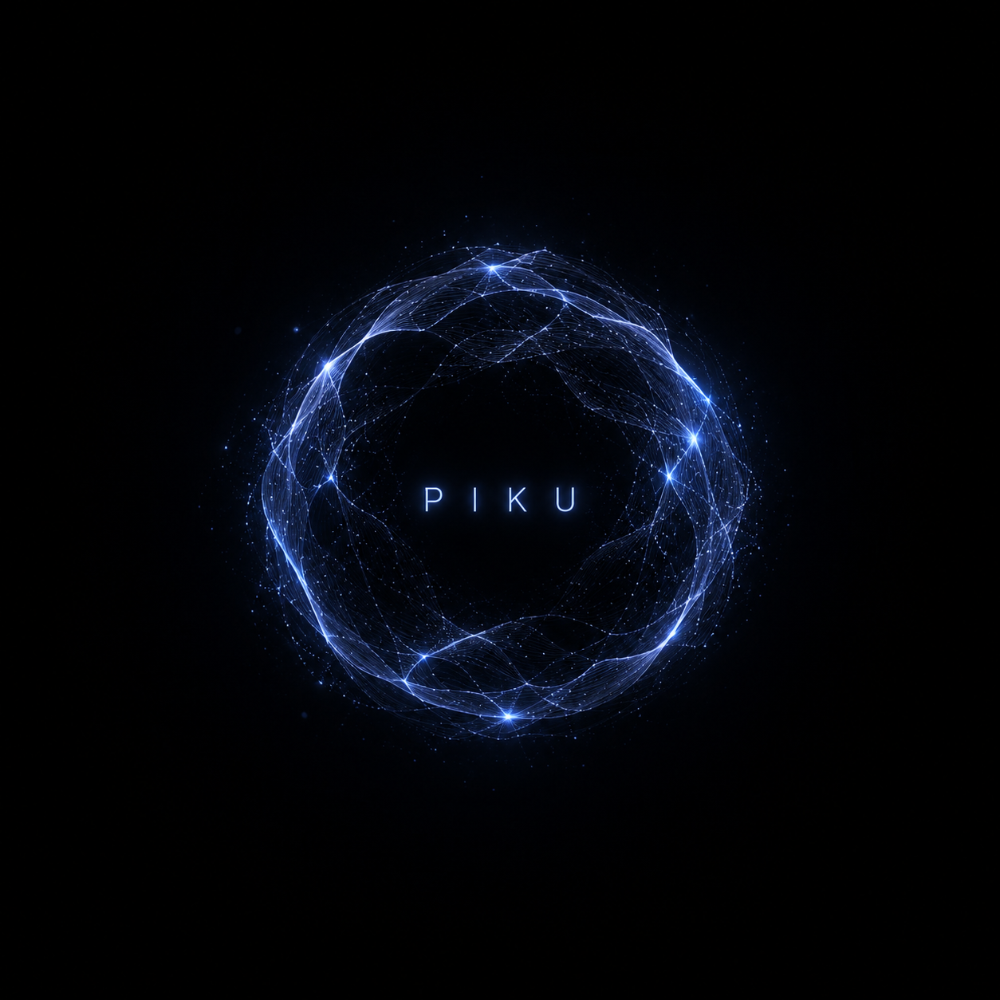
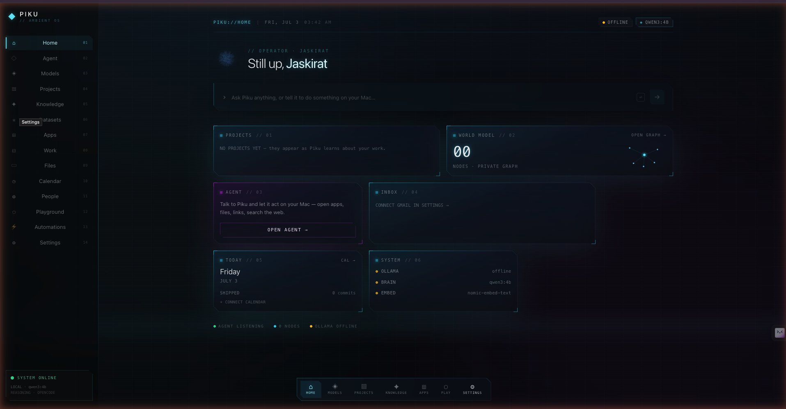

# Piku

<p align="center">
  
</p>

**Local-first ambient AI companion** that builds a personal World Model from conversation and context — on your machine.

<p align="center">
  
</p>

## What it does

- **Ambient** — available without hopping between chat tabs  
- **Local-first** — Tauri desktop shell + Ollama  
- **Memory-driven** — structured memory and a knowledge graph  

## Stack

Tauri 2 · React 18 · Vite · Framer Motion · Ollama · IndexedDB

## Run

```bash
npm install
npm run tauri dev
```

Node 20+ and a local Ollama install recommended.

## Docs

See [`docs/CANONICAL/`](docs/CANONICAL/) for vision, architecture, and roadmap.
